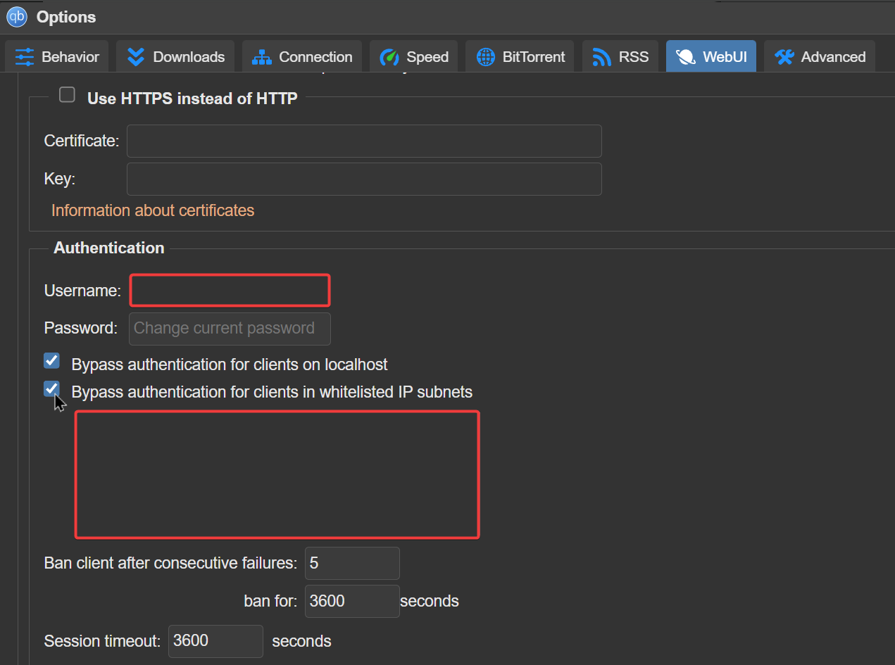

## qBittorrent Recent Downloads

At-a-***glance*** view your recent downloads


### Prerequisites (Required)

* First, open Qbittirrent -> Settings -> WebUI -> ✅ Bypass authentication for clients in whitelisted IP subnets.
* And Add your IP address to the WhiteList.
* Save.



### Setup
Give the widget a quick read through (it's not too long)


### Preview


```yaml
- type: custom-api
  title: qBittorrent - Recent Downloads
  cache: 5m #<--updated as needed
  # feel free to use the environment variable or hardcode it
  url: http://${QBITTORRENT_URL}:8080/api/v2/torrents/info?sort=completion_on&reverse=true&limit=25 #<-- at the end change how many you want
  paremeters:
    #if you want to hide one or more categories, add them here and use the parameter in the template condition
    hiddenCat1: "do-not-show-in-widget"
  template: |
    {{ /* this starts the loop for each torrent */ }}
    {{ range .JSON.Array "" }}

    {{ $name := .String "name" }}
    {{ $category := .String "category" }}
    {{ $content_path := .String "content_path" }}
    {{ $tags := .String "tags" }}

    {{/* these lines below can filter out hidden categories */}}
    {{ $hiddenCat1 := ( .String "hiddenCat1" ) }}
    {{ if or (ne $category $hiddenCat1 ) }}

    <div style="height:1rem"></div>

    {{/* basic fields */}}
    <h>{{ $name }}</h>
    <h2 class="ghost-text">{{ $content_path }}</h2>
    <h2 class="ghost-text">{{ $category }}</h2>
    <h2 class="ghost-text">{{ $tags }}</h2>

    {{/* this is the progress the loading bar*/}}
    <div style="align-items:center;gap:6px;margin-top:3px;">
        <h2 class="ghost-text">{{ printf "%.0f%%" (mul (.Float "progress") 100.0) }}</h2>
        <div style="position:relative;background:rgba(255,255,255,0.1);border-radius:2px;height:2px;width:100%;overflow:hidden;">
          <div style="width:calc({{ .Float "progress" }} * 100%);height:100%;background:var(--color-primary);"></div>
        </div>
    </div>

    <div style="height:1rem"></div>

    {{ end }}
    {{ end }}
```

## Contributions
[@jgarza9788](https://github.com/jgarza9788) - Upload stats suggestion and code contribution
